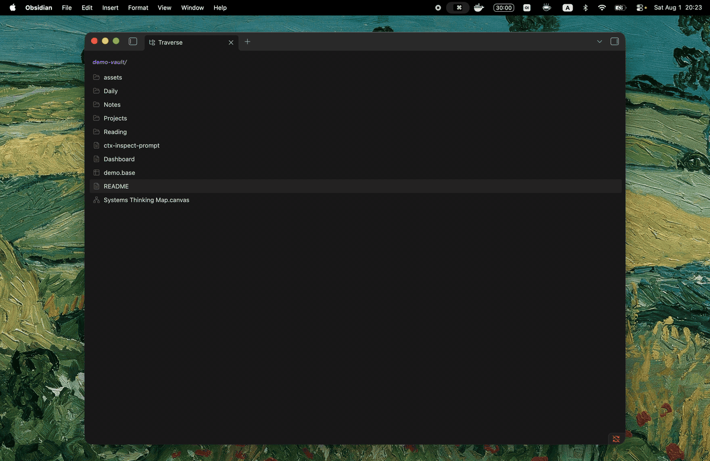

# Traverse

A keyboard-first file browser for people who want to navigate between files and manage their Obsidian vault without leaving the keyboard. You can move through folders, preview files without opening extra tabs, and stay in one focused view.

## Getting started

You can open Traverse from the ribbon or command palette; however, it is strongly recommended to assign a preferred shortcut in **Settings → Hotkeys**.

The keybindings should be intuitive enough for vim users to pick up immediately, especially those that are familiar with terminal explorers like `yazi`.

### Navigation

| Key | Action |
| --- | --- |
| `j` / `k`, `↓` / `↑` | Move down / up |
| `h` / `←` | Go to the parent folder |
| `l` / `→` | Enter the selected folder |
| `Enter` | Open the selected file, or enter a folder |
| `Mod+Enter` | Enter a folder without opening its folder note |
| `gg` / `G` | Jump to the first / last item |
| `H` / `L` | Go backward / forward through folder history |
| `q` | Return to the note that was open before Traverse |
| `~` | Jump directly to the vault root |
| `/` | Fuzzy-filter the current folder by name |
| `s` | Search files and folders across the vault |
| `P` | Show or hide the preview |
| `J` / `K` | Scroll the preview |
| `F` | Open the current folder in the system file manager |
| `T` | Open the current folder in the preferred terminal |
| `?` | Show a quick key reference |

### File/folder operations

Commands act on the selected items, or on the item under the cursor when nothing is selected.

| Key | Action |
| --- | --- |
| `Space` | Toggle the current item and move down |
| `v` | Start or end visual range selection |
| `Mod+A` | Select all listed items |
| `Escape` | Leave the current mode or clear the selection |
| `a` / `A` | Create a file / folder |
| `C` | Create a folder note, choosing from the configured extensions |
| `r` | Rename |
| `y` / `x` | Copy / cut |
| `p` | Paste into the current folder; pasting cut items moves them |
| `d` | Delete a file |
| `D` | Delete a folder and its contents |

Every operation that changes the vault asks for confirmation.

## Previews

You can previews Markdown, images, audio, video, PDFs, text files, folders, and Obsidian Bases.

Press `P` to show or hide the preview for the current Traverse pane. Under **Settings → Traverse**, you can resize the preview card within the right half of the view and decide whether it should automatically hide when the workspace becomes crowded.

## Folder notes

Traverse can handle folder notes. The feature is enabled by default; adjust its location, name-template, and extension options under **Settings → Traverse → Folder notes**.

- `Enter` opens the folder note.
- `l`, `→`, or `Mod+Enter` enters the folder.
- `d` deletes only the folder note; `D` deletes the folder using Obsidian’s configured deletion behavior.

## Installation

From the Obsidian Community plugins directory:

1. Open **Settings → Community plugins → Browse**.
2. Search for **Traverse**.
3. Select **Install**, then **Enable**.

For manual installation, download `main.js`, `manifest.json`, and `styles.css` from a release and place them in `.obsidian/plugins/traverse/` inside your vault.

## License

[MIT License](LICENSE).
